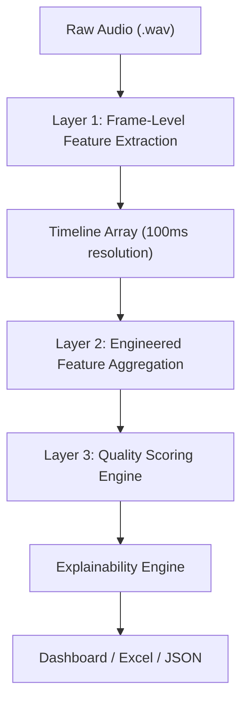

# Voice Call Analysis Engine — Feature & Scoring Documentation

> **Version:** Phase 1 Final  
> **Last Updated:** 2026-07-07  
> **Source:** [Mmfsl Repository](file:///Users/ayushgoel/Mmfsl)

---

## Table of Contents

1. [Pipeline Architecture](#1-pipeline-architecture)
2. [Layer 1 — Raw Feature Extraction](#2-layer-1--raw-feature-extraction)
3. [Layer 2 — Engineered Features](#3-layer-2--engineered-features)
4. [Layer 3 — Quality Scores](#4-layer-3--quality-scores)
5. [Grading & Explainability](#5-grading--explainability)
6. [Configuration & Weights](#6-configuration--weights)
7. [Block Analysis](#7-block-analysis)
8. [Export & Audio Slicing](#8-export--audio-slicing)

---

## 1. Pipeline Architecture



| Layer | Purpose | Source File |
|-------|---------|-------------|
| Layer 1 | Extract per-frame raw acoustic/prosodic/quality metrics | `extractors/*.py` |
| Layer 2 | Aggregate timeline into statistical summaries | `analytics/core/engineered_features.py` |
| Layer 3 | Compute 7 quality scores from aggregated features | `analytics/core/scoring.py` |
| Explainability | Grade scores and list positive/negative factors | `analytics/core/explainability.py` |

### Processing Parameters

| Parameter | Default Value | Description |
|-----------|---------------|-------------|
| Sample Rate | 16,000 Hz | Target resampling rate |
| Window Length | 1.0 second | Duration of each analysis frame |
| Hop Size | 0.5 seconds | Step between consecutive frames |
| Silence RMS Threshold | 0.015 | RMS below this = silence |
| Dropout RMS Threshold | 0.003 | RMS below this = signal dropout |
| Long Pause Duration | 1.0 second | Gap duration to classify as a pause event |

---

## 2. Layer 1 — Raw Feature Extraction

Each feature is extracted per analysis window (1s window, 0.5s hop) from the raw waveform.

---

### 2.1 Acoustic Features

#### RMS (Root-Mean-Square Amplitude)
- **File:** [acoustic.py](file:///Users/ayushgoel/Mmfsl/extractors/acoustic.py#L13-L17)
- **Formula:**
  ```
  RMS = √(mean(x²))
  ```
- **Output key:** `rms`
- **Range:** 0.0 → 1.0 (normalized amplitude)
- **Interpretation:** Measures overall signal power/amplitude in the window.

#### Energy
- **File:** [acoustic.py](file:///Users/ayushgoel/Mmfsl/extractors/acoustic.py#L20-L24)
- **Formula:**
  ```
  Energy = mean(x²)
  ```
- **Output key:** `energy`
- **Range:** 0.0 → 1.0
- **Interpretation:** Mean squared signal amplitude. Energy = RMS².

#### Loudness (dB)
- **File:** [acoustic.py](file:///Users/ayushgoel/Mmfsl/extractors/acoustic.py#L27-L32)
- **Formula:**
  ```
  Loudness_dB = 20 × log₁₀(max(RMS, ε))
  where ε = 1e-10
  ```
- **Output key:** `loudness_db`
- **Range:** −200 dB → 0 dB
- **Interpretation:** Decibel-scale representation of volume. −60 dB = very quiet, −10 dB = loud.

#### Zero Crossing Rate (ZCR)
- **File:** [acoustic.py](file:///Users/ayushgoel/Mmfsl/extractors/acoustic.py#L35-L42)
- **Formula:**
  ```
  ZCR = count(sign changes in signal) / (N - 1)
  ```
- **Output key:** `zero_crossing_rate`
- **Range:** 0.0 → 1.0
- **Interpretation:** Rate at which the signal changes sign. High ZCR = noisy/unvoiced. Low ZCR = tonal/voiced.

#### Spectral Centroid
- **File:** [acoustic.py](file:///Users/ayushgoel/Mmfsl/extractors/acoustic.py#L45-L56)
- **Formula:**
  ```
  Centroid = Σ(fᵢ × |FFT(x)|ᵢ) / Σ(|FFT(x)|ᵢ)
  ```
- **Output key:** `spectral_centroid_hz`
- **Range:** 0 → Nyquist (8000 Hz)
- **Interpretation:** Center of mass of the frequency spectrum. Higher = brighter tone. Lower = deeper, muddier tone.

#### Spectral Bandwidth
- **File:** [spectral_features.py](file:///Users/ayushgoel/Mmfsl/extractors/spectral_features.py#L8-L27)
- **Formula:**
  ```
  Bandwidth = √(Σ((fᵢ - centroid)² × |FFT|ᵢ) / Σ(|FFT|ᵢ))
  ```
  Uses Hanning windowing before FFT.
- **Output key:** `spectral_bandwidth_hz`
- **Interpretation:** Spread of frequencies around the centroid. Wide = rich harmonics. Narrow = pure tone.

#### Spectral Roll-off
- **File:** [spectral_features.py](file:///Users/ayushgoel/Mmfsl/extractors/spectral_features.py#L30-L51)
- **Formula:**
  ```
  Find frequency f where:
  cumsum(|FFT|) ≥ 0.85 × total_magnitude
  ```
  Uses Hanning windowing before FFT.
- **Output key:** `spectral_rolloff_hz`
- **Interpretation:** Frequency below which 85% of spectral energy lies. Indicates how far the signal energy extends into higher frequencies.

---

### 2.2 Quality Features

#### SNR (Signal-to-Noise Ratio)
- **File:** [quality.py](file:///Users/ayushgoel/Mmfsl/extractors/quality.py#L13-L27)
- **Formula:**
  ```
  signal_power = 95th percentile of x²
  noise_power  = 10th percentile of x²
  SNR_dB = 10 × log₁₀(signal_power / noise_power)
  ```
- **Output key:** `snr_db`
- **Range:** ~0 dB → 40+ dB
- **Interpretation:** Ratio of speech signal to background noise. >20 dB = clean. <10 dB = noisy.

#### Speech Quality Proxy
- **File:** [quality.py](file:///Users/ayushgoel/Mmfsl/extractors/quality.py#L30-L41)
- **Formula:**
  ```
  clipping_ratio = mean(|x| > 0.98)
  noise_floor = 10th percentile of |x|
  quality = 1.0 − min(1.0, clipping_ratio × 8.0 + noise_floor × 0.5)
  quality = clamp(0.0, 1.0)
  ```
- **Output key:** `speech_quality_proxy`
- **Range:** 0.0 → 1.0
- **Interpretation:** Combined metric penalizing clipping distortion and high noise floor. 1.0 = perfect, 0.0 = unusable.

#### Silence Ratio
- **File:** [quality.py](file:///Users/ayushgoel/Mmfsl/extractors/quality.py#L44-L51)
- **Formula:**
  ```
  silence_ratio = mean(|x| < threshold)
  where threshold = 0.015 (configurable)
  ```
- **Output key:** `silence_ratio`
- **Range:** 0.0 → 1.0
- **Interpretation:** Fraction of samples below the silence threshold in this window.

#### HNR (Harmonics-to-Noise Ratio)
- **File:** [prosody_advanced.py](file:///Users/ayushgoel/Mmfsl/extractors/prosody_advanced.py#L120-L151)
- **Formula:**
  ```
  r = autocorrelation peak / autocorrelation at lag 0
  r = clamp(0.01, 0.99)
  HNR_dB = 10 × log₁₀(r / (1 − r))
  ```
- **Output key:** `hnr_db`
- **Range:** −20 dB → +20 dB
- **Interpretation:** Ratio of harmonic (periodic/voice) energy to noise energy. Higher = cleaner voice. Values > 7 dB typically indicate voiced speech.

#### Spectral Flux
- **File:** [spectral_advanced.py](file:///Users/ayushgoel/Mmfsl/extractors/spectral_advanced.py#L8-L44)
- **Formula:**
  ```
  Divide window into 512-sample sub-frames (256-sample hop)
  For each consecutive pair of frames:
      flux = √(Σ(normalized_magnitude_diff²))
  spectral_flux = mean(all flux values)
  ```
- **Output key:** `spectral_flux`
- **Interpretation:** Measures how rapidly the frequency content changes over time. High flux = speech transitions or noise events.

---

### 2.3 Prosody Features

#### Pitch (Fundamental Frequency F₀)
- **File:** [pitch.py](file:///Users/ayushgoel/Mmfsl/extractors/pitch.py#L8-L35)
- **Algorithm:** Autocorrelation-based pitch estimation
- **Formula:**
  ```
  1. Center the signal: x' = x − mean(x)
  2. Compute full autocorrelation: corr = autocorrelate(x')
  3. Search for peak in lag range [sr/500, sr/75]
     (corresponding to 75–500 Hz pitch range)
  4. confidence = corr[peak_lag] / corr[0]
  5. If confidence ≥ 0.25: pitch_hz = sample_rate / peak_lag
     Else: pitch_hz = None (unvoiced)
  ```
- **Output key:** `pitch_hz`
- **Range:** 75–500 Hz (or `None` if unvoiced)
- **Interpretation:** Fundamental frequency of the speaker's voice. Male ~85–180 Hz. Female ~165–255 Hz.

#### Jitter (Pitch Period Perturbation)
- **File:** [prosody_advanced.py](file:///Users/ayushgoel/Mmfsl/extractors/prosody_advanced.py#L9-L65)
- **Formula:**
  ```
  1. Detect pitch period T via autocorrelation
  2. Step through signal by T, find peak amplitude positions
  3. periods[] = differences between consecutive peak positions
  4. jitter_% = (mean(|Δperiods|) / mean(periods)) × 100
  ```
- **Output key:** `jitter_pct`
- **Range:** 0% → 100%
- **Interpretation:** Cycle-to-cycle variation in pitch periods. Normal speech < 1.5%. Higher jitter = trembling, shaky, or stressed voice.

#### Shimmer (Amplitude Perturbation)
- **File:** [prosody_advanced.py](file:///Users/ayushgoel/Mmfsl/extractors/prosody_advanced.py#L68-L117)
- **Formula:**
  ```
  1. Detect pitch period T via autocorrelation
  2. Step through signal by T, capture peak amplitude of each cycle
  3. shimmer_% = (mean(|Δamplitudes|) / mean(amplitudes)) × 100
  ```
- **Output key:** `shimmer_pct`
- **Range:** 0% → 100%
- **Interpretation:** Cycle-to-cycle variation in peak amplitude. Normal speech < 3%. Higher shimmer = breathiness, fatigue, or vocal strain.

#### Speaking Rate
- **File:** [prosody_advanced.py](file:///Users/ayushgoel/Mmfsl/extractors/prosody_advanced.py#L154-L187)
- **Formula:**
  ```
  1. Rectify signal: |x|
  2. Low-pass envelope: 100ms rolling mean
  3. Detect peaks above (mean + 0.3 × std) threshold
  4. speaking_rate = peak_count / window_duration_seconds
  ```
- **Output key:** `speaking_rate_sps` (syllables per second)
- **Range:** 0 → ~8 sps
- **Interpretation:** Estimated syllable rate. Normal conversational speech = 3–5 sps.

#### Formant Dispersion
- **File:** [spectral_advanced.py](file:///Users/ayushgoel/Mmfsl/extractors/spectral_advanced.py#L47-L81)
- **Formula:**
  ```
  F1 = peak frequency in [300, 1000] Hz band
  F2 = peak frequency in [1000, 3000] Hz band
  formant_dispersion = F2 − F1
  ```
- **Output key:** `formant_dispersion`
- **Interpretation:** Distance between the first two vocal formants. Reflects vocal tract characteristics and vowel articulation clarity.

---

### 2.4 Temporal Event Detection

#### VAD (Voice Activity Detection)
- **File:** [vad.py](file:///Users/ayushgoel/Mmfsl/extractors/vad.py#L8-L21)
- **Rule:**
  ```
  speech = (RMS ≥ 0.015) AND (ZCR < 0.35)
  ```
- **Output key:** `speech` (boolean)
- **Interpretation:** True = speech is active. The ZCR check prevents high-frequency noise from being classified as speech.

#### Pause Detection
- **File:** [vad.py](file:///Users/ayushgoel/Mmfsl/extractors/vad.py#L24-L32)
- **Rule:**
  ```
  pause = (RMS < 0.015)
  ```
  Consecutive pause windows lasting > 1.0 second are aggregated into pause events.
- **Output key:** `pause` (boolean)

#### Dropout Detection
- **File:** [vad.py](file:///Users/ayushgoel/Mmfsl/extractors/vad.py#L35-L44)
- **Rule:**
  ```
  dropout = (peak_amplitude < 0.003) AND (RMS < 0.003)
  ```
  Much stricter than silence. Represents complete signal loss (technical failure).
- **Output key:** `dropout` (boolean)

#### Speaker Diarization
- **File:** [speaker/diarizer.py](file:///Users/ayushgoel/Mmfsl/extractors/speaker/diarizer.py)
- **Method:** Spectral clustering on speaker embedding features
- **Output:** List of segments: `{speaker: "SPEAKER_00", start: 0.0, end: 5.2, duration: 5.2}`

---

## 3. Layer 2 — Engineered Features

> **Source:** [engineered_features.py](file:///Users/ayushgoel/Mmfsl/analytics/core/engineered_features.py)

Layer 2 aggregates the per-frame timeline into four statistical categories.

---

### 3.1 Audio Quality

| Feature | Formula | Unit |
|---------|---------|------|
| `average_rms` | `mean(all RMS values)` | amplitude |
| `average_energy` | `mean(all energy values)` | amplitude² |
| `average_loudness` | `mean(all loudness_db values)` | dB |
| `average_snr` | `mean(all snr_db values)` | dB |
| `noise_level` | `mean(loudness_db WHERE speech=False)` | dB |
| `recording_stability` | `std(all snr_db values)` | dB |
| `dropout_count` | `count(dropout events)` | integer |
| `dropout_duration` | `sum(dropout event durations)` | seconds |
| `clipping_percentage` | Reserved for future clipping detector | % |

> **Noise level** is computed by averaging loudness values during **non-speech** frames only, representing the ambient noise floor.

---

### 3.2 Voice Stability

| Feature | Formula | Unit |
|---------|---------|------|
| `pitch_stability` | `std(all pitch_hz values)` | Hz |
| `pitch_variance` | `var(all pitch_hz values)` | Hz² |
| `energy_stability` | `std(all energy values)` | amplitude² |
| `energy_variance` | `var(all energy values)` | amplitude⁴ |
| `loudness_stability` | `std(all loudness_db values)` | dB |
| `loudness_variance` | `var(all loudness_db values)` | dB² |
| `speaking_stability` | `std(all speaking_rate_sps values)` | sps |
| `avg_jitter_pct` | `mean(all jitter_pct values)` | % |
| `avg_shimmer_pct` | `mean(all shimmer_pct values)` | % |

> **Stability label:** Assigned as `"Stable"` if avg_jitter < 1.5%, otherwise `"Moderate"`.

---

### 3.3 Speech Behaviour

| Feature | Formula | Unit |
|---------|---------|------|
| `speech_percentage` | `(speech_frames / total_frames) × 100` | % |
| `silence_percentage` | `100 − speech_percentage` | % |
| `pause_count` | `count(pause events)` | integer |
| `average_pause_duration` | `mean(pause durations)` | seconds |
| `longest_pause` | `max(pause durations)` | seconds |
| `pause_frequency` | `pause_count / (duration_minutes)` | per minute |

---

### 3.4 Conversation Behaviour

| Feature | Formula | Unit |
|---------|---------|------|
| `turn_count` | `count(speaker segments)` | integer |
| `speaker_change_count` | `count(speaker_change events)` | integer |
| `average_turn_duration` | `mean(speaker segment durations)` | seconds |
| `longest_turn` | `max(speaker segment durations)` | seconds |
| `response_latency` | `mean(gaps between consecutive speaker segments)` | seconds |
| `conversation_balance` | `|speaker_A_talk_% − speaker_B_talk_%|` | % difference |

> **Response latency** only counts positive gaps (silences between turns). Negative gaps (overlaps) are counted separately for the flow score.

---

## 4. Layer 3 — Quality Scores

> **Source:** [scoring.py](file:///Users/ayushgoel/Mmfsl/analytics/core/scoring.py)

All scores are computed as integers from **0 to 100**, clamped with `max(0, min(100, round(...)))`.

---

### 4.1 Audio Quality Score

```
base       = 100 × avg_speech_quality
snr_bonus  = (avg_snr − 15) if avg_snr > 15 else 0
noise_pen  = max(0, noise_level + 50) if noise_level > −45 else 0
dropout_pen = 5 × dropout_count

Audio Quality = base + snr_bonus − dropout_pen − noise_pen
```

| Factor | Effect |
|--------|--------|
| High speech quality proxy (>0.85) | Raises base score |
| SNR above 15 dB | Adds bonus points |
| Each dropout | −5 points |
| Noise floor above −45 dB | Penalty proportional to loudness |

---

### 4.2 Recording Reliability Score

```
Recording Reliability = 100
    − (8 × dropout_count)
    − (10 × dropout_duration)
    − (0.5 × max(0, noise_level + 50))
    − (5 × clipping_percentage)
```

| Factor | Penalty |
|--------|---------|
| Each dropout occurrence | −8 points |
| Each second of dropout | −10 points |
| Elevated noise floor | −0.5 per dB above −50 dB |
| Each % of clipped samples | −5 points |

---

### 4.3 Voice Stability Score

```
Voice Stability = 100
    − (0.4 × pitch_std)
    − (3.0 × loudness_std)
    − (500.0 × energy_std)
    − (6.0 × avg_jitter_pct)
    − (2.5 × avg_shimmer_pct)
```

| Factor | Penalty Weight | Rationale |
|--------|----------------|-----------|
| Pitch std dev | −0.4 per Hz | Large pitch swings = agitation |
| Loudness std dev | −3.0 per dB | Volume inconsistency |
| Energy std dev | −500.0 per unit | Micro-energy fluctuations |
| Jitter | −6.0 per % | Vocal cord tremor |
| Shimmer | −2.5 per % | Breathiness/amplitude perturbation |

---

### 4.4 Conversation Flow Score

```
Flow = 100
    − (8 × pauses_per_minute)
    − (12 × overlap_count)
    − (4 × max(0, response_latency − 1.5))
    − (0.1 × silence_percentage)
    + min(15, 1.2 × speaker_change_count)
```

| Factor | Effect |
|--------|--------|
| High pause frequency | −8 per pause/min (dead air) |
| Each speaker overlap | −12 points (interruptions) |
| Response latency > 1.5s | −4 per extra second |
| Excessive silence | −0.1 per % |
| Active speaker changes | +1.2 per change (up to +15 bonus) |

---

### 4.5 Conversation Balance Score

```
balance_diff = |speaker_A_talk_% − speaker_B_talk_%|

Conversation Balance = 100 − (2 × balance_diff)
```

| Scenario | balance_diff | Score |
|----------|-------------|-------|
| Perfect 50/50 split | 0% | 100 |
| 60/40 split | 20% | 60 |
| 80/20 monologue | 60% | 0 |

---

### 4.6 Speech Activity Score

```
Speech Activity = (speech_% + (100 − silence_%)) / 2
```

This effectively averages the speech density from two perspectives. When speech% = 80 and silence% = 20:
```
Score = (80 + 80) / 2 = 80
```

---

### 4.7 Overall Call Health Score (Weighted Composite)

```
Overall = (w₁×AQ + w₂×RR + w₃×VS + w₄×CF + w₅×CB + w₆×SA) / Σwᵢ
```

| Component | Weight | Default |
|-----------|--------|---------|
| Audio Quality | w₁ | **0.25** (25%) |
| Recording Reliability | w₂ | **0.15** (15%) |
| Voice Stability | w₃ | **0.15** (15%) |
| Conversation Flow | w₄ | **0.20** (20%) |
| Conversation Balance | w₅ | **0.15** (15%) |
| Speech Activity | w₆ | **0.10** (10%) |

> Weights are configurable in [config.py](file:///Users/ayushgoel/Mmfsl/config.py#L25-L32).

---

## 5. Grading & Explainability

> **Source:** [explainability.py](file:///Users/ayushgoel/Mmfsl/analytics/core/explainability.py)

### 5.1 Grade Thresholds

| Grade | Score Range |
|-------|------------|
| **Excellent** | ≥ 90 |
| **Good** | 75 – 89 |
| **Fair** | 60 – 74 |
| **Poor** | < 60 |

> Thresholds are configurable in [config.py](file:///Users/ayushgoel/Mmfsl/config.py#L33-L37).

### 5.2 Explainability Rules

Each score dimension has deterministic rules that fire positive (✓) or negative (✗) factors:

#### Audio Quality Rules

| Condition | Type | Message |
|-----------|------|---------|
| SNR ≥ 22 dB | ✓ | "High Signal-to-Noise Ratio (SNR)" |
| SNR < 15 dB | ✗ | "Low Signal-to-Noise Ratio (SNR) - background noise present" |
| Noise floor ≤ −48 dB | ✓ | "Quiet noise floor during silent intervals" |
| Noise floor > −42 dB | ✗ | "Elevated background hum/noise floor" |
| Dropout count = 0 | ✓ | "Clean signal transmission with zero dropouts" |
| Dropout count > 0 | ✗ | "Detected N signal transmission dropout(s)" |
| Speech quality ≥ 0.85 | ✓ | "Consistent voice signal clarity" |
| Speech quality < 0.65 | ✗ | "Degraded vocal signal quality" |

#### Recording Reliability Rules

| Condition | Type | Message |
|-----------|------|---------|
| Dropout count = 0 | ✓ | "Continuous signal stream (no dropouts)" |
| Dropout count > 0 | ✗ | "Signal stream dropouts: N occurrences (Xs total)" |
| Clipping < 0.2% | ✓ | "Zero signal amplitude clipping/distortion" |
| Clipping ≥ 0.2% | ✗ | "Audio clipping detected: X% of samples clipped" |
| Recording stability ≥ 85 | ✓ | "Highly stable signal strength" |
| Recording stability < 85 | ✗ | "Unstable channel signal strength" |

#### Voice Stability Rules

| Condition | Type | Message |
|-----------|------|---------|
| Pitch std < 12 Hz | ✓ | "Highly stable fundamental pitch (monotone or calm)" |
| Pitch std > 28 Hz | ✗ | "High pitch fluctuations (suggests emotional shaking or agitation)" |
| Jitter < 1.5% AND Shimmer < 3% | ✓ | "Stable vocal chords (low jitter/shimmer)" |
| Jitter ≥ 2.5% | ✗ | "Micro-frequency tremors detected (high jitter)" |
| Shimmer ≥ 5.0% | ✗ | "Micro-amplitude breathing variations (high shimmer)" |
| Speaking std < 1.0 | ✓ | "Consistent speaking tempo and cadence" |
| Speaking std > 2.5 | ✗ | "Uneven speech rate (rushed or halting tempo)" |

#### Conversation Flow Rules

| Condition | Type | Message |
|-----------|------|---------|
| Response latency < 1.3s | ✓ | "Fast conversational response latency" |
| Response latency > 2.2s | ✗ | "Delayed response gaps (indicates hesitation or confusion)" |
| Overlap count = 0 | ✓ | "Clean turn-taking with no double-talk" |
| Overlap count > 4 | ✗ | "Frequent speaker interruptions: N overlaps (Xs)" |
| Speaker changes ≥ 15 | ✓ | "Active back-and-forth flow" |
| Speaker changes < 6 | ✗ | "Stagnant turn exchange (long monologue chunks)" |
| Silence % > 35% | ✗ | "Excessive silence / pauses during the call (X%)" |

#### Conversation Balance Rules

| Condition | Type | Message |
|-----------|------|---------|
| Balance diff ≤ 15% | ✓ | "Perfect conversational balance between participants" |
| Balance diff > 50% | ✗ | "Highly dominated conversation: speaker imbalance of X%" |
| Turn count ≥ 18 | ✓ | "High turn parity (both speakers engaged)" |
| Turn count < 8 | ✗ | "Low turn parity (one-sided monologue)" |

#### Speech Activity Rules

| Condition | Type | Message |
|-----------|------|---------|
| Speech % ≥ 70% | ✓ | "High active speech density (low dead air)" |
| Speech % < 50% | ✗ | "High amount of silence/non-speech intervals (X%)" |
| Pause frequency < 5/min | ✓ | "Continuous fluent speech delivery" |
| Pause frequency > 12/min | ✗ | "Frequent brief pauses breaking speaking flow" |

#### Overall Call Health Rules

| Condition | Type | Message |
|-----------|------|---------|
| Audio Quality ≥ 85 | ✓ | "Excellent raw audio quality with stable channels" |
| Audio Quality < 85 | ✗ | "Overall call health degraded by poor/unstable audio quality" |
| Flow ≥ 80 | ✓ | "Fluent, interactive dialog exchange" |
| Flow < 60 | ✗ | "Conversational flow interrupted by latency, dead air, or overlaps" |
| Voice Stability ≥ 85 | ✓ | "Vocal registers remain calm, stable, and regular" |
| Voice Stability < 65 | ✗ | "Frustrated, rapid, or trembling vocal pitch stability" |

---

## 6. Configuration & Weights

> **Source:** [config.py](file:///Users/ayushgoel/Mmfsl/config.py)

All scoring weights, grade thresholds, and extraction parameters are centralized in a single `PipelineConfig` dataclass:

```python
@dataclass
class ScoreConfig:
    weights = {
        "audio_quality": 0.25,
        "recording_reliability": 0.15,
        "voice_stability": 0.15,
        "conversation_flow": 0.20,
        "conversation_balance": 0.15,
        "speech_activity": 0.10,
    }
    thresholds = {
        "Excellent": 90.0,
        "Good": 75.0,
        "Fair": 60.0,
    }
```

To adjust scoring behaviour, modify the weight values in `config.py`. The sum of weights is automatically normalized.

---

## 7. Block Analysis

> **Source:** [block_analysis.py](file:///Users/ayushgoel/Mmfsl/analytics/engines/block_analysis.py)

Block analysis divides the call into configurable time windows (5s, 10s, 15s, 20s, 30s) and computes per-block:

| Metric | Description |
|--------|-------------|
| Block ID | Sequential block number |
| Start / End Time | Temporal boundaries |
| Dominant Speaker | Speaker with maximum talk time in block |
| Speech % | Percentage of speech activity |
| Avg Loudness / Pitch / SNR | Mean acoustic values within the block |
| Pause Count & Duration | Pauses occurring within the block |
| Dropout Count | Signal loss events in the block |
| Speaker Changes | Turn switches within the block |
| Audio Quality | Good / Fair / Poor label |
| Block Summary | Rule-based sentence (see below) |

### Block Summary Rules

| Priority | Condition | Summary |
|----------|-----------|---------|
| 1 | Speech % < 15% | "Mostly silence." |
| 2 | Dropout count > 0 | "Speech with dropout." |
| 3 | Audio Quality = Poor OR SNR < 10 | "Low audio quality." |
| 4 | Pause count > 1 | "Multiple pauses." |
| 5 | Speaker changes > 1 | "Speaker transition." |
| 6 | Default | "Clear speech." |

---

## 8. Export & Audio Slicing

> **Source:** [export.py](file:///Users/ayushgoel/Mmfsl/analytics/export.py)

### Excel Report Structure
- **Single sheet** named `sheet block details`
- **15 columns** per the block analysis schema above
- **Audio Clip column** contains clickable `=HYPERLINK()` formulas pointing to sliced `.wav` files

### Audio Slicing
When exporting, the engine reads the source `.wav` file using `soundfile`, slices it into segments matching the selected block size, and saves them:

```
exports/
  └── <audio_file_name>/
        └── <block_size>s_blocks/
              ├── block_000.wav
              ├── block_001.wav
              └── ...
```

Example for a file `call.wav` with 15-second blocks:
```
exports/call/15s_blocks/block_000.wav   (0s – 15s)
exports/call/15s_blocks/block_001.wav   (15s – 30s)
...
```

The hyperlinks in Excel use absolute `file://` URIs that open the chunk directly in the OS media player when clicked.
